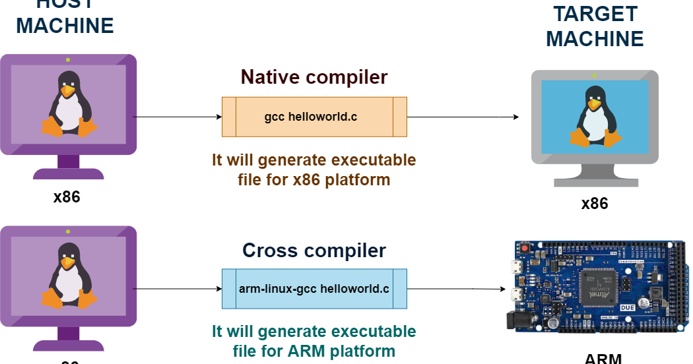

# Task 1 : Compilateur croisé et émulateur ARM avec Qemu #


La compilation croisée consiste à compiler du code source sur une plateforme (comme un PC)
pour qu’il puisse être exécuté sur une autre plateforme (comme un appareil ARM). L’idée est
de configurer un compilateur qui peut générer des exécutables compatibles avec l’architecture
ARM. Le compilateur GNU arm-none-eabi-gcc est un exemple largement utilisé dans les
projets ARM embarqués. Explorer la compilation croisée implique :


## Installation et Test d'un compilateur croisé ARM ##
1. Mise à jour des paquets et installation du compilateur croisé ARM

```bash 
sudo apt-get install build-essential gcc-arm-linux-gnueabihf

```
2. Mise à jour des paquets et installation du compilateur croisé ARM:

```bash
sudo apt-get install build-essential gcc-arm-linux-gnueabihf
```
3. Compilation d'un programme (hello.c) avec le compilateur croisé ARM
```bash
arm-linux-gnueabihf-gcc hello.c -o helloarm
```
4. Test d'exécution sur pc

_L'exécutable généré ne peut etre exécuté sur l'architecture du pc (x86) car celui-ci est cross-compilé pour etre exécuter sur une architecture de type ARM._
5. Installation de **QEMU** pour émuler ARM sur le PC
```bash
sudo apt update
sudo apt install qemu-user qemu-user-static binfmt-support
sudo apt install libc6-armhf-cross
```
6. Exécuter le programme avec **QEMU**
```bash
 qemu-arm -L /usr/arm-linux-gnueabihf ./helloarm
```

