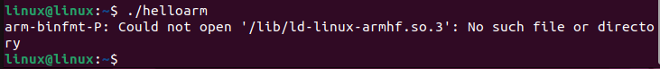
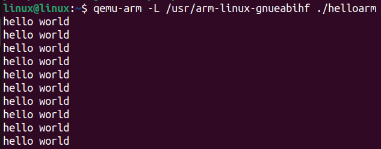

# Task 1: Cross-Compiler and ARM Emulator with QEMU

Cross-compilation involves compiling source code on one platform (like a PC) so that it can be executed on another platform (like an ARM device). The idea is to configure a compiler that can generate executables compatible with the ARM architecture. The GNU compiler `arm-none-eabi-gcc` is a widely used example in embedded ARM projects. Exploring cross-compilation involves:


## Installation and Testing of an ARM Cross-Compiler

1. Update packages and install the ARM cross-compiler:

```bash 
sudo apt-get install build-essential gcc-arm-linux-gnueabihf
```

2. Update packages and install the ARM cross-compiler (repeated step in original, keeping for consistency):

```bash
sudo apt-get install build-essential gcc-arm-linux-gnueabihf
```

3. Compilation of a program (hello.c) with the ARM cross-compiler:
```bash
arm-linux-gnueabihf-gcc hello.c -o helloarm
```

4. Execution test on PC:

_The generated executable cannot be executed on the PC architecture (x86) because it is cross-compiled to run on an ARM type architecture._

5. Installation of **QEMU** to emulate ARM on the PC:
```bash
sudo apt update
sudo apt install qemu-user qemu-user-static binfmt-support
sudo apt install libc6-armhf-cross
```

6. Execute the program with **QEMU**:
```bash
 qemu-arm -L /usr/arm-linux-gnueabihf ./helloarm
```

