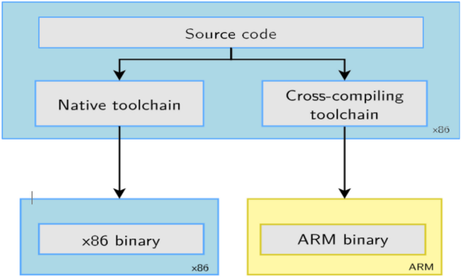
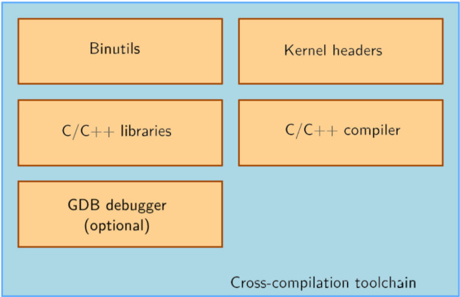
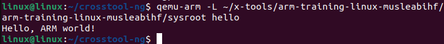

# Task 2: Building a Cross-Compilation Toolchain

## 1. Description
The usual development tools available on a GNU/Linux workstation constitute a native compilation chain.
This compilation chain runs on your workstation and generates code for it, typically for the x86 architecture.
For embedded systems development, it is generally impossible or not interesting to use a native compilation chain.
► The target is too limited in terms of storage and/or memory.
► The target is very slow compared to your workstation.
► You may not want to install all development tools on your target.
That is why cross-compilation chains are generally used. They run on your workstation but generate code for your target.

---

---

## 2. Components of a Cross-Compilation Chain

---

---

*   **Binutils**: A set of tools for manipulating binary files, including utilities like the assembler and linker, essential for managing object files.
*   **Kernel Headers**: Files essential for establishing the interface between user programs and the kernel, ensuring compatibility with the target system.
*   **C/C++ Libraries**: Standard libraries, such as libc for C or the standard C++ library, which provide the basic functions necessary for program execution.
*   **C/C++ Compiler**: The compiler responsible for converting C/C++ source code into binary executables for a specific target architecture.
*   **GDB Debugger (optional)**: A debugging tool allowing analysis and correction of compiled programs, particularly useful for debugging on the target.

## 3. Specific Objectives

*   ► Be able to understand the foundations of cross-compilation.
*   ► Be able to install and configure Crosstool-NG.
*   ► Be able to generate a cross-compiler for Raspberry Pi 3 (aarch64 architecture).
*   ► Be able to configure the execution environment for the cross-compiler.

## 4. Steps to Follow

### A. Install Dependencies
```bash
sudo apt install build-essential git autoconf bison flex texinfo help2man gawk libtool-bin \
 libncurses5-dev unzip gettext python3
```

### B. Install and Configure Crosstool-NG

#### Getting Crosstool-ng
```bash
git clone https://github.com/crosstool-ng/crosstool-ng
cd crosstool-ng/
git checkout crosstool-ng-1.28.0
```

#### Building and Installing Crosstool-ng
Since we are not building Crosstool-ng from a release archive, but from a git repository, we must first generate a configure script and, more generally, all generated files that are provided in the source archive of a release:
```bash
./bootstrap
```
We can then either install Crosstool-ng globally on the system or keep it locally in its download directory. We will choose the latter solution. As documented at https://crosstool-ng.github.io/docs/install/#hackers-way

```bash
./configure --enable-local
make
./ct-ng help
```

### C. Configure Crosstool-NG for Raspberry Pi 3

#### Configure the Toolchain to Produce
A single installation of Crosstool-ng allows producing as many toolchains as you want, for different architectures, with different C libraries and different versions of various components.

Crosstool-ng comes with a set of ready-made configuration files for different typical configurations: Crosstool-ng calls them samples. They can be listed using:
```bash 
./ct-ng list-samples 
```

We will load the Cortex A8 sample. Load it with the command:
```bash 
./ct-ng  arm-cortex_a8-linux-gnueabi
```
Then, to refine the configuration, let's launch the menuconfig interface:
```bash 
./ct-ng  menuconfig
```

**In Path and misc options:**
*   If not already done, enable `Try features marked as EXPERIMENTAL`.

**In Target options:**
*   Set `Use specific FPU (ARCH_FPU)` to `vfpv3`.
*   Set `Floating point` to `hardware (FPU)`.

**In Toolchain options:**
*   Set `Tuple's vendor string (TARGET_VENDOR)` to `training`.
*   Set `Tuple's alias (TARGET_ALIAS)` to `arm-linux`. Thus, we can use the compiler with `arm-linux-gcc`, a shorter name than the one based on the full toolchain tuple.

**In Operating System:**
*   Set `Version of linux` to the closest but earlier version than 6.6. It is important that the kernel headers used in the toolchain are not newer than the kernel that will run on the board (v6.6).

**In C-library:**
*   If not already done, set `C library` to `musl (LIBC_MUSL)`.
*   Keep the default version proposed.

**In C compiler:**
*   Set `Version of gcc` to `14.2.0`.
*   Ensure that `C++ (CC_LANG_CXX)` is enabled.

**In Debug facilities:**
*   Remove all options here. Some debugging tools can be provided in the toolchain, but they can also be built via filesystem build tools.

#### Produce the Toolchain
Nothing is simpler:
```bash
./ct-ng build
```
The toolchain will be installed by default in `$HOME/x-tools/`. That’s something you could have changed in Crosstool-ng’s configuration.

### D. Install QEMU
Can you still execute this binary from your x86 host machine?
For this, install the QEMU user emulator, which only emulates the target instruction set, and not a whole system with its peripherals:
```bash
sudo apt install qemu-user
```

### E. Compile and Test a Program
You can now test your toolchain by adding `$HOME/x-tools/arm-training-linux-musleabihf/bin/` to your `PATH` environment variable and compiling the simple `hello.c` program in your main lab directory with `arm-linux-gcc`:
```bash
arm-linux-gcc -o hello hello.c
```
You can use the `file` command on your binary to verify that it has indeed been compiled for the ARM architecture.
```bash
file hello
--- 
hello: ELF 32-bit LSB executable, ARM, EABI5 version 1 (SYSV), dynamically linked, interpreter /lib/ld-musl-armhf.so.1, not stripped
---
```
Then, try to launch the QEMU user emulator for ARM:
```bash
qemu-arm hello
```
You will probably get an error:
```text
qemu-arm: Could not open '/lib/ld-musl-armhf.so.1': No such file or directory
```
---
What is happening is that `qemu-arm` cannot find the shared library loader (compiled for ARM) that this binary depends on.

#### Locate the Library Loader in the Toolchain
```bash
find ~/x-tools-name -name ld-musl-armhf.so.1
```

You should get something like:
```text
/home/tux/x-tools/arm-training-linux-musleabihf/arm-training-linux-musleabihf/sysroot/lib/ld-musl-armhf.so.1
```

#### Tell QEMU Where to Find Libraries
You can now use the `-L` option of `qemu-arm` to tell it where the shared libraries are located:
```bash
qemu-arm -L ~/x-tools/arm-training-linux-musleabihf/arm-training-linux-musleabihf/sysroot hello
```
We get:
```text
Hello, ARM world!
```

## 5. Documentation
For more detailed information on each step and the tools used, you can refer to the Bootlin documentation. Bootlin offers comprehensive resources and training on cross-compilation, using Crosstool-NG, and other tools for development on embedded architectures.

*   Bootlin Documentation: https://bootlin.com/doc/training/embedded-linux-bbb/embedded-linux-bbb-labs.pdf