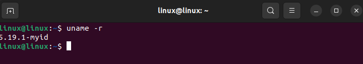
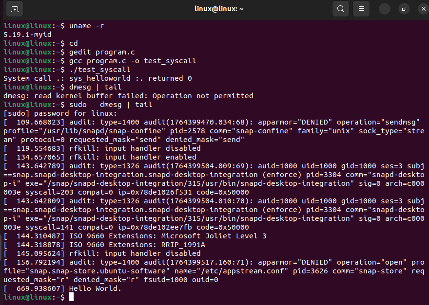

# Task 3: Adding a System Call to the Linux Kernel

## I. Introduction
System calls are interfaces that allow user programs to communicate with the kernel to execute essential tasks such as file management, process management, and resource management.

### Objective
Add a system call to the Linux kernel.

### Steps to Follow
A. Modifying the kernel source code to add the system call.

B. Compiling the kernel with the added system call.

C. Testing the system call in a Linux environment.

## II. Creation and Integration of a Custom "Hello World" System Call in the Linux Kernel

This section details the steps to add a simple system call that prints "Hello World" in the kernel logs.

### 1. Environment Preparation
Before starting, update your system and install the dependencies necessary for kernel compilation.

```bash
sudo apt update && sudo apt upgrade -y
# Installation of compilation tools and required libraries
sudo apt install gcc build-essential libncurses-dev libssl-dev libelf-dev bison flex -y
sudo apt install dwarves
# Cleaning up unnecessary packages
sudo apt clean && sudo apt autoremove -y
```

### 2. Downloading and Extracting the Kernel
Download the Linux kernel sources (version 5.19.1 in this example) and extract them.

```bash
# Downloading the kernel archive
wget -P ~/ https://mirrors.edge.kernel.org/pub/linux/kernel/v5.x/linux-5.19.1.tar.xz
# Extracting the archive to the home directory
tar -xvf ~/linux-5.19.1.tar.xz -C ~/
# Reboot recommended to ensure the system is clean
reboot
```

### 3. Creating the System Call Code
Navigate to the kernel directory and create a directory for your system call.

```bash
cd ~/linux-5.19.1
mkdir helloworld
```

Create the source file `helloworld.c`:
```bash
gedit helloworld/helloworld.c
```
Add the following code:
```c
#include <linux/kernel.h>
#include <linux/syscalls.h>

// Definition of the 'helloworld' system call which takes no arguments
SYSCALL_DEFINE0(helloworld)
{
    printk("Hello World.\n"); // Prints the message in the kernel log
    return 0;
}
```

Create the `Makefile` for this directory so the kernel knows how to compile it:
```bash
gedit helloworld/Makefile
```
Content:
```make
obj-y := helloworld.o
```

### 4. Integration into the Kernel
You must now inform the kernel build system of the existence of your new system call.

#### Modifying the Main Makefile
```bash
gedit Makefile
```
1.  Search for the `EXTRAVERSION` line (at the beginning) and add your identifier (e.g., `-myid`).
2.  Search for `core-y` (search for `core-y += kernel/ mm/ fs/ ipc/ security/ crypto/ block/`).
3.  Add `helloworld/` to the end of this line.

#### Adding the Prototype
Add the function declaration in the system calls header.
```bash
gedit include/linux/syscalls.h
```
Go to the end of the file, just before the `#endif` line, and add:
```c
asmlinkage long sys_helloworld(void);
```
#### Registration in the System Call Table (x86_64)
```bash
gedit arch/x86/entry/syscalls/syscall_64.tbl
```
1.  Go to the end of the first section (before the x32 calls section).
2.  Add a new line following the chronology of numbers.
3.  Use tabs for spacing.
4.  **Note the system call number** (e.g., 451), you will need it later.

Format:
```text
<number>    common    helloworld    sys_helloworld
```

### 5. Configuration and Compilation
Configure the kernel before compilation.
```bash
# Copy the current configuration (faster than reconfiguring everything)
sudo make menuconfig
# Or alternatively: sudo make localmodconfig
```

Modify the `.config` file to avoid trusted keys errors:
```bash
gedit .config
```
Search for `CONFIG_SYSTEM_TRUSTED_KEYS` and `CONFIG_SYSTEM_REVOCATION_KEYS` and empty the quotes:
```text
CONFIG_SYSTEM_TRUSTED_KEYS=""
CONFIG_SYSTEM_REVOCATION_KEYS=""
```

Start the compilation (this may take some time):
```bash
# Check the number of available cores
nproc
# Compile with 4 threads (adjust according to your CPU)
sudo make -j4
# Install modules
sudo make modules_install -j4
# Install the kernel
sudo make install -j4
```

### 6. Updating the Bootloader and Rebooting
Update GRUB to include the new kernel.
```bash
sudo gedit /etc/default/grub
```
change the line ``GRUB_TIMEOUT=0`` to ``GRUB_TIMEOUT=10``
change the line ``GRUB_TIMEOUT_STYLE=hidden`` to ``GRUB_TIMEOUT_STYLE=menu``   
```bash
sudo update-grub
sudo shutdown -r now
```
Upon reboot, in the GRUB menu, select "Advanced options for Ubuntu" and choose your kernel (the one with your `EXTRAVERSION`).
test that the new kernel is running, run the command `uname -r`, it should show something like photo.



### 7. Testing the System Call
Once rebooted on the new kernel, create a user program to test your system call.

Create `program.c`:
```bash
cd ~
gedit program.c
```

Content:
```c
#include <stdio.h>
#include <linux/kernel.h>
#include <sys/syscall.h>
#include <unistd.h>

int main() {
    // Replace 'linenum' with the number you noted in syscall_64.tbl
    long int linenum = 451; 
    long int checkcall = syscall(linenum); 
    
    printf("System call .: sys_helloworld :. returned %ld\n", checkcall);
    return 0;
}
```

Compile and run:
```bash
gcc program.c -o test_syscall
./test_syscall
```

Check the kernel logs to see the "Hello World" message:
```bash
dmesg | tail
```
You should see "Hello World." at the end of the logs like this photo:



---
