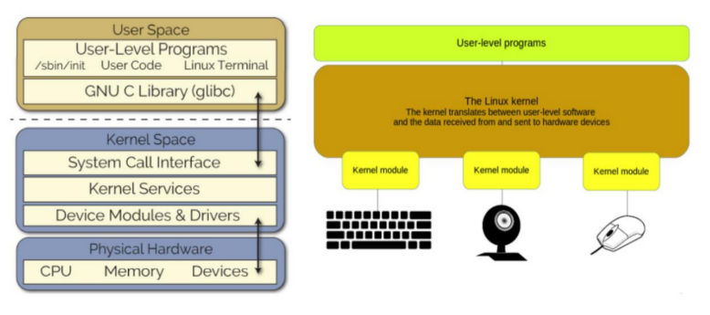
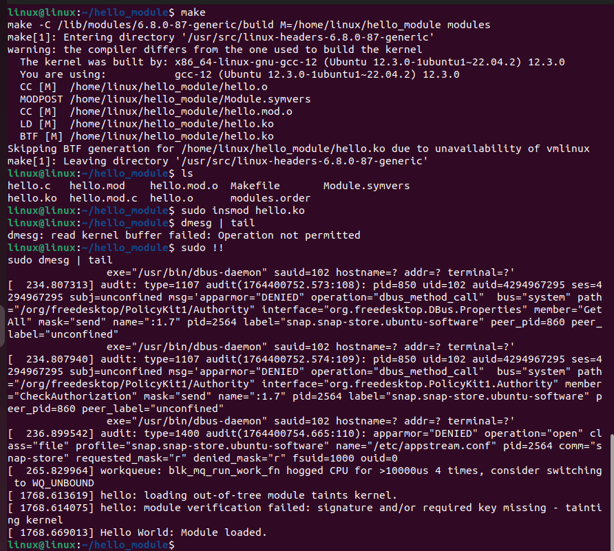
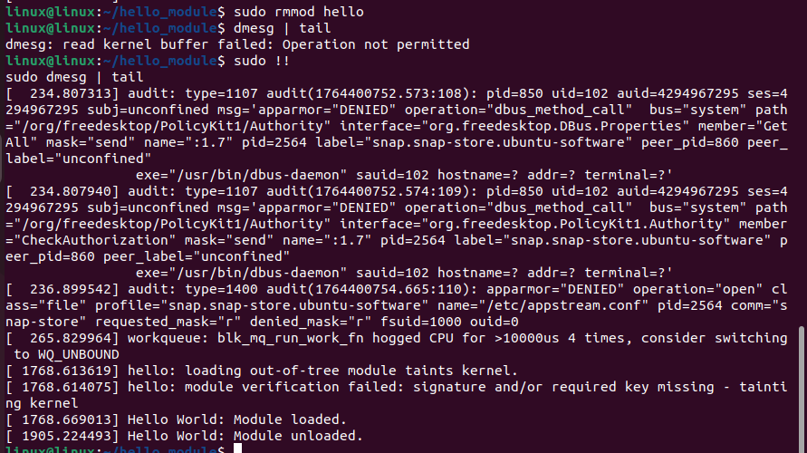

# Task 4: Adding a 'Hello World' Module to the Linux Kernel

## Introduction
Kernel modules are pieces of code that can be loaded and unloaded into the kernel upon demand. They extend the functionality of the kernel without the need to reboot the system.


## Objective
Create, compile, and load a simple "Hello World" kernel module.

## Steps to Follow

### 1. Install Kernel Headers
To compile a kernel module, you need the header files corresponding to your running kernel.

```bash
sudo apt update
sudo apt install build-essential linux-headers-$(uname -r)
```

### 2. Create the Module Source Code
Create a directory for your module and the source file `hello.c`.

```bash
mkdir hello_module
cd hello_module
gedit hello.c
```

Add the following code to `hello.c`:

```c
#include <linux/init.h>
#include <linux/module.h>
#include <linux/kernel.h>

MODULE_LICENSE("GPL");
MODULE_AUTHOR("Your Name");
MODULE_DESCRIPTION("A simple Hello World LKM");
MODULE_VERSION("0.1");

static int __init hello_init(void) {
    printk(KERN_INFO "Hello World: Module loaded.\n");
    return 0;
}

static void __exit hello_exit(void) {
    printk(KERN_INFO "Hello World: Module unloaded.\n");
}

module_init(hello_init);
module_exit(hello_exit);
```

### 3. Create the Makefile
Create a `Makefile` to compile the module using the kernel build system.

```bash
gedit Makefile
```

Add the following content (ensure you use tabs for indentation where required):

```make
obj-m += hello.o

all:
	make -C /lib/modules/$(shell uname -r)/build M=$(PWD) modules

clean:
	make -C /lib/modules/$(shell uname -r)/build M=$(PWD) clean
```

### 4. Compile the Module
Run `make` to compile the module.

```bash
make
```

This will generate a `hello.ko` file, which is the compiled kernel module.

### 5. Load and Test the Module
Load the module into the kernel:

```bash
sudo insmod hello.ko
```

Check the kernel logs to see the "Hello World" message:

```bash
dmesg | tail
```

You should see: `Hello World: Module loaded.`



### 6. Unload the Module
Remove the module from the kernel:

```bash
sudo rmmod hello
```

Check the logs again to see the exit message:

```bash
dmesg | tail
```

You should see: `Hello World: Module unloaded.`



## References
*   [Writing a Simple Hello World Kernel Module on Linux (Ubuntu) - Bharath Reddy](https://medium.com/@bharathreddy_90228/writing-a-simple-hello-world-kernel-module-on-linux-ubuntu-137999d494f6)
