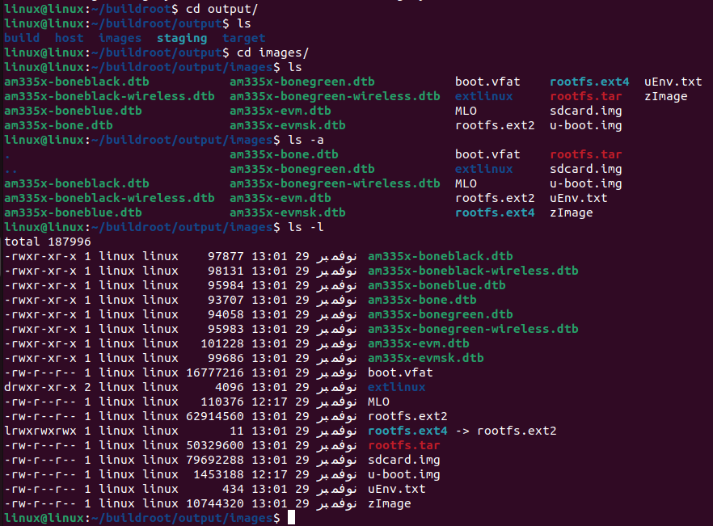
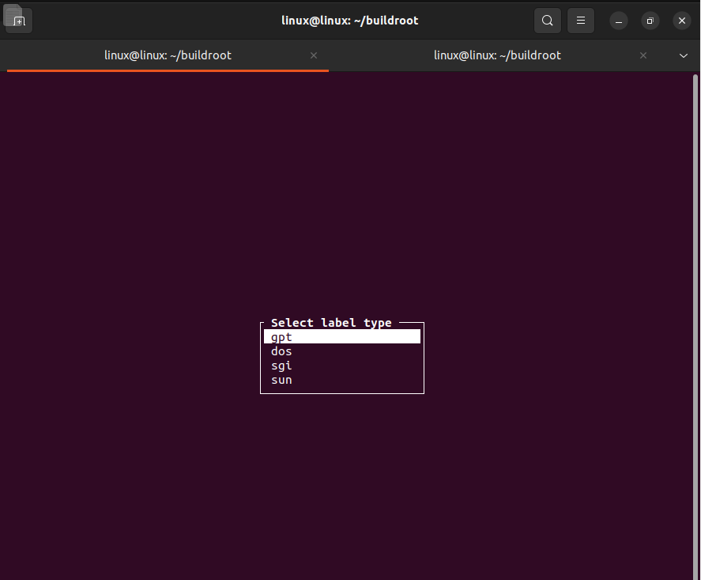
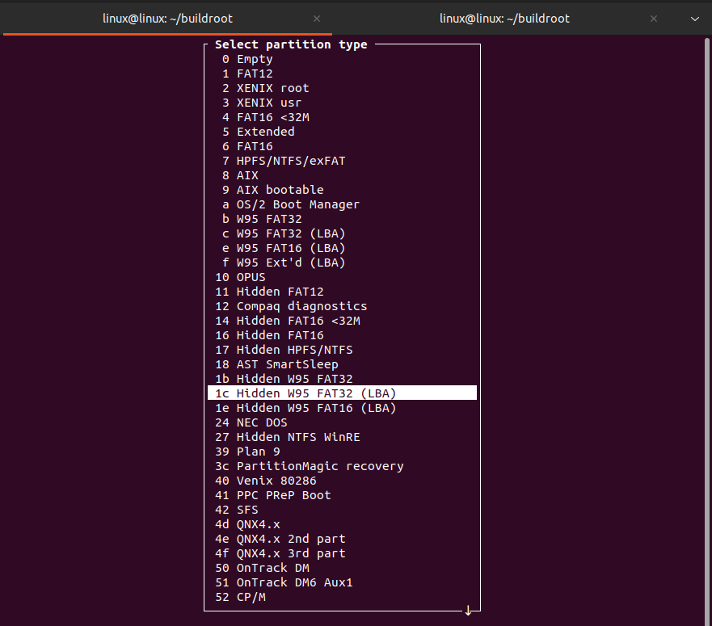
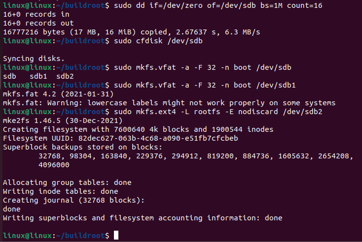
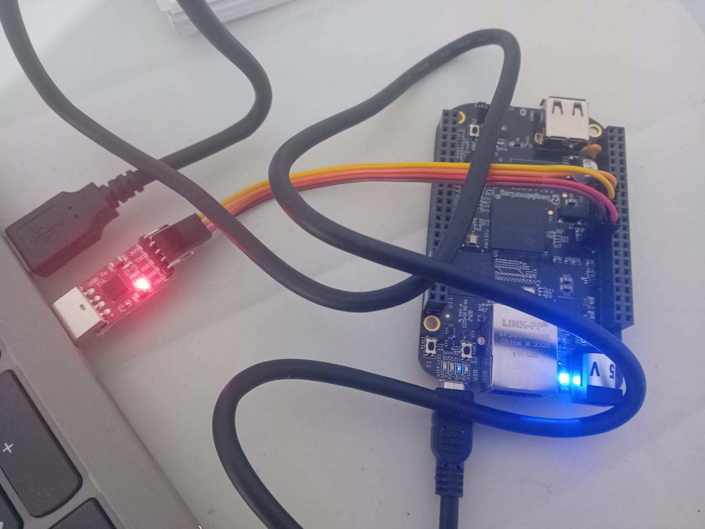
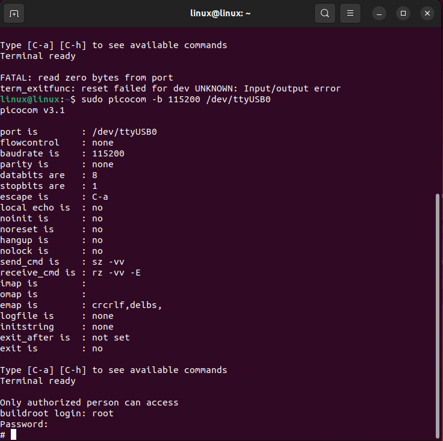

# Task 5: Creating a Minimal Linux System for the BeagleBone Black with Buildroot

## 1. Objectives
*   **Understand** the role and principles of an embedded Linux build system and compare Buildroot to other tools offering similar functionalities.
*   **Create** a simple embedded Linux system with Buildroot: create a configuration, execute the build, and install the result on an embedded platform.
*   **Adjust** the Buildroot configuration to build an embedded Linux system adapted to specific needs: choice of the cross-compilation toolchain, management of the Linux kernel configuration, customization of the root filesystem content, etc.

## 2. Process of Building an Embedded Linux System with Buildroot

Buildroot is a simple, efficient, and easy-to-use tool to generate embedded Linux systems through cross-compilation. It handles everything from the toolchain to the root filesystem.

### Step 1: Configuration (`make menuconfig`)
The user starts by configuring Buildroot using the `make menuconfig` command. This allows choosing the target system configuration, including the architecture (e.g., ARM), the tools to use (BusyBox), kernel options, and more. The generated `.config` file contains all these options.

**For BeagleBone Black:**
Buildroot includes a default configuration for the BeagleBone Black, which simplifies the setup process.

1.  **Download Buildroot:**
    ```bash
    git clone https://git.buildroot.net/buildroot
    cd buildroot
    git checkout 2024.02.x # Use a stable branch
    ```

2.  **Load Default Configuration:**
    Instead of manually configuring every option, load the pre-defined configuration for BeagleBone Black:
    ```bash
    make beaglebone_defconfig
    ```

3.  **Customize (Optional):**
    If you need to add packages or change settings:
    ```bash
    make menuconfig
    ```
    *   **Target Architecture:** ARM (Little Endian)
    *   **Target Architecture Variant:** cortex-A8
    *   **Toolchain:** Buildroot toolchain (default) or External toolchain
    *   **System Configuration:**
        *   **Root password:** Set a password to enable SSH access.
    *   **Target Packages:**
        *   **Networking applications:**
            *   `dropbear` (lightweight SSH server) or `openssh`.
            *   `wpa_supplicant` (for Wi-Fi connection).
            *   `iw` (for Wi-Fi configuration).
        *   **Hardware handling:**
        *   **Hardware handling:**
            *   `libgpiod` (modern GPIO access).
                *   *Location:* `Target packages` -> `Libraries` -> `Hardware handling` -> `libgpiod`.
                *   *Note:* If `libgpiod` is not visible (requires kernel headers >= 4.8), use the **alternatives** below.
            *   **Alternatives if libgpiod is missing:**
                *   **Sysfs GPIO:** No package needed. Standard Linux interface at `/sys/class/gpio`.
                *   `devmem2` (direct register access).
                    *   *Location:* `Target packages` -> `Hardware handling` -> `devmem2`.
            *   `i2c-tools` (for I2C sensors).
            *   **Firmware:**
                *   Select `linux-firmware`.
                *   **Inside the `linux-firmware` menu:**
                    *   Go to `WiFi firmware` -> Select `TI wl18xx` (for BeagleBone Black Wireless).
                *   *Optional:* Select `am33x-cm3` (Power Management firmware for AM33xx).
        *   **Text editors and viewers:**
            *   `nano` (simple text editor).

### Step 2: Compilation (`make`)
Once the configuration is defined, the `make` command starts the system compilation. Buildroot uses a cross-compiler (like GCC) to generate the files necessary for the system to function on an embedded architecture.

```bash
make
```
*Note: This process can take a significant amount of time (30 minutes to several hours) depending on your computer's performance and internet connection, as it downloads and compiles all source code.*

### Step 3: Image Generation
The generated images include the root filesystem image, the kernel image, and the bootloader image. These components are essential to start the embedded system.

The `genimage` tool is used to group these elements into a final image (like an SD card image) that can be transferred to the target platform.

**Output Files:**
After a successful build, the results are located in `output/images/`:
*   `MLO`: The primary bootloader (SPL).
*   `u-boot.img`: The secondary bootloader (U-Boot).
*   `zImage`: The Linux kernel image.
*   `am335x-boneblack.dtb`: The Device Tree Blob for BeagleBone Black.
*   `rootfs.tar`: The root filesystem archive.
*   `sdcard.img`: The complete, bootable SD card image (generated by `genimage`).
---

---

### Step 4: Prepare the SD Card and Flash the System
Instead of using the generated `sdcard.img` with `dd`, we will manually partition the SD card and copy the files. This gives you more control and understanding of the boot process.

#### 1. Prepare the SD Card
Our SD card needs to be split in two partitions:
*   **Partition 1 (Boot):** FAT32, bootable. Stores the bootloader (`MLO`, `u-boot.img`), kernel (`zImage`), and Device Tree.
*   **Partition 2 (Rootfs):** ext4. Stores the root filesystem.

**Identify your SD card:**
Check `cat /proc/partitions`. It is usually `mmcblk0` (internal reader) or `sdX` (USB reader). **Warning:** Do not touch `/dev/sda`!

**Partitioning and Formatting (assuming `/dev/mmcblk0`):**

1.  **Unmount partitions:**
    ```bash
    sudo umount /dev/sdb*
    ```
2.  **Erase the beginning of the card:**
    ```bash
    sudo dd if=/dev/zero of=/dev/sdb bs=1M count=16
    ```
3.  **Create partitions using `cfdisk`:**
    ```bash
    sudo cfdisk /dev/sdb
    ```
    *   Select **dos** label type.

    

    *   **New** -> **Primary** -> **128M** -> **Type** -> **c (W95 FAT32 (LBA))** or **e (W95 FAT16)** -> **Bootable**.

    
    
    *   **New** -> **Primary** -> **Remaining space** -> **Type** -> **83 (Linux)**.
    *   **Write** -> **Yes** -> **Quit**.

4.  **Format partitions:**
    ```bash
    # Boot partition (FAT32)
    sudo mkfs.vfat -a -F 32 -n boot /dev/sdb1
    
    # Rootfs partition (ext4)
    sudo mkfs.ext4 -L rootfs -E nodiscard /dev/sdb2
    ```
    *Remove and re-insert the SD card to mount the partitions automatically (usually in `/media/$USER/boot` and `/media/$USER/rootfs`).*
    ---
    
    ---

#### 2. Flash the System
1.  **Mount Partitions (if not auto-mounted):**
    ```bash
    # Create mount points
    sudo mkdir -p /media/$USER/boot /media/$USER/rootfs
    
    # Mount partitions (assuming /dev/sdb1 and /dev/sdb2)
    sudo mount /dev/sdb1 /media/$USER/boot
    sudo mount /dev/sdb2 /media/$USER/rootfs
    ```

2.  **Copy Boot Files:**
    Copy the bootloader, kernel, and device tree to the **boot** partition:
    ```bash
    cp output/images/MLO /media/$USER/boot/
    cp output/images/u-boot.img /media/$USER/boot/
    cp output/images/zImage /media/$USER/boot/
    cp output/images/am335x-boneblack.dtb /media/$USER/boot/
    # If using BeagleBone Black Wireless, use:
    # cp output/images/am335x-boneblack-wireless.dtb /media/$USER/boot/
    ```

3.  **Extract Root Filesystem:**
    ```bash
    sudo tar -C /media/$USER/rootfs/ -xf output/images/rootfs.tar
    ```

4.  **Configure Bootloader (`extlinux.conf`):**
    Create the directory and file in the **boot** partition:
    ```bash
    mkdir -p /media/$USER/boot/extlinux
    nano /media/$USER/boot/extlinux/extlinux.conf
    ```
    Add this content:
    ```text
    label buildroot
      kernel /zImage
      devicetree /am335x-boneblack.dtb
      append console=ttyO0,115200 root=/dev/sdb2 rootwait
    ```
    *(Update devicetree name if needed).*

5.  **Finish:**
    ```bash
    sync
    ```
    Unmount both partitions and eject the card.

### Step 5: Boot the System
1.  Insert SD card into BeagleBone Black.
2.  Hold **S2 button** and plug in USB power.
3.  Release S2. The system should boot.
4.  Login as `root`.
---


---


---

*Troubleshooting:* If it doesn't boot, reset U-Boot env:
```bash
env default -f -a
saveenv
reset
```

### Step 6: Explore the Build Log
To analyze the build process:
```bash
grep ">>>" build.log
```

## Documentation
For more detailed information on each step and the tools used, you can refer to the following documentation:

*   [Building Linux Kernel and Preparing bootable SD CARD for Beaglebone Board - YouTube](https://www.youtube.com/results?search_query=Building+Linux+Kernel+and+Preparing+bootable+SD+CARD+for+Beaglebone+Board)
*   [Buildroot Labs - Bootlin](https://bootlin.com/doc/training/buildroot/buildroot-labs.pdf)
*   [Buildroot Embedded Linux BeagleBone Black - Bill Van Leeuwen](https://billvanleeuwen.ca/buildroot-embedded-linux-beaglebone-black/)
